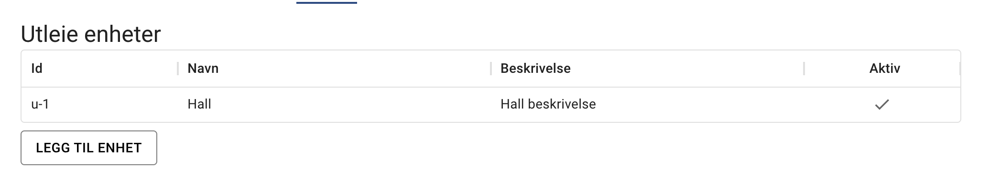
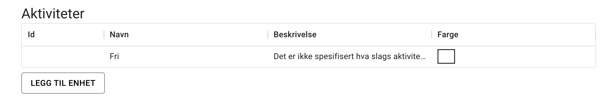
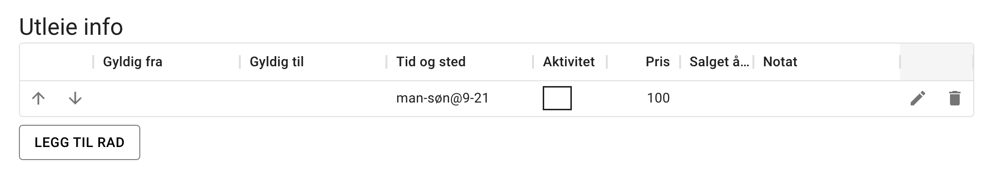
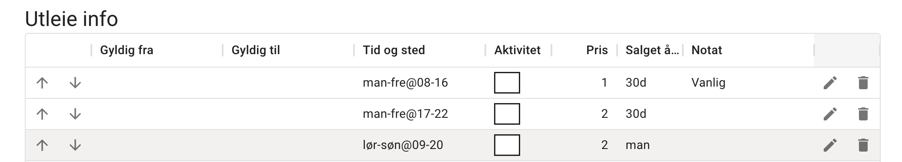
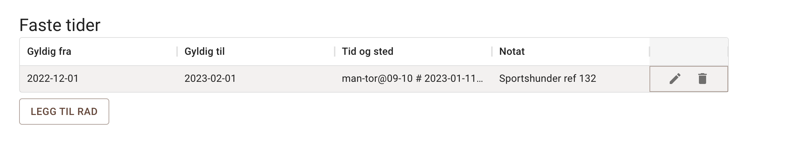

import { Aside } from '@astrojs/starlight/components';

Siden for utleie informasjon definerer alt som skal kunne leies til hvilken tid og pris.

<Aside type="note" title="Husk å lagre">
Endringer på utleie siden blir ikke gjeldene før man har trykket på lagre knappen helt nederst på siden.
</Aside>

## Utleie enheter

Her registreres flatene,tingene eller det som kan leies ut. For de fleste er dette den ene plassen man skal leie ut. Hallen, utebanen, klubbhuset eller lignende. Systemet er tilpasset 1 til 3 enheter. Man kan ha flere men brukergrensesnittet vil da bli dårligere. Er det behov for flere enheter så fikser vi det ved behov. Ta kontakt.

Enheten u-1 blir automatisk lagt inn. Her kan du endre navn og beskrivelse men denne kan ikke slettes. Navnet må være kort da det skal vises i timevelgeren på bookingsiden.

## Aktiviteter

Aktiviteter tilknyttes timer som skal leies ut. Her kan man f.eks sette opp at hallen er oppsatt med en agility eller rally bane. For utleiere som kun leier ut en tom flate så vil aktiviteten som automatisk bli lagt men navn “Fri” holde.

## Utleie info

Der defineres hva som skal leies ut. Man kan spesifisere enhet, dager, timer, hvor lenge før man skal kunne booke timen og enda litt til. Med det nye systemet er det lagt til en rad som sier at timene 9 til 21 i alle ukens dager kan man leie alle enheter til en pris av 100 kroner.

Er det flere rader i tabellen vil første rad som matcher en time være den som systemet velger. Tid og sted kolonnen har et format som blir beskrevet i detalje her: [Tid og Sted](https://www.notion.so/Tid-og-sted-notasjon-5e0383c4f6334164b5b56047877d3c3f?pvs=21). Vi tar likevel et lite eksempel her også:

I tabellen over er det definert 3 regler (aka rader). Når systemet skal finne ut av hva den skal ta for pris på torsdag kl 18 så begynner den på øverste regel. Den matcher ukedag men ikke tid så den går da til neste regel. Her matcher tid og sted og den velger da prisen 2. Denne kan leies ut 30 dager før timen faktisk er.

Er man usikker på hvordan systemet leser utleie info radene så kan man se på forhåndsvisningen lengst ned på siden. Den skal hvis endringene du gjør før du lagrer endringene.

## Faste tider

Faste tider er typisk sesong utleie, eller unntak fra utleie informasjonen. Her kan man markere timer som booket eller utilgjengelig.

I eksemplet over er det Sportshunder som har fast leie mandag til torsdag fra kl 9 til kl 11 (timen kl 10 slutter kl 11) i perioden 1. desember 2022 til 1. Februar 2023. Med et unntak den 11. Januar.

## Forhåndsvisning

Dette er timevelgeren men basert utelukkende på utleieinfo og faste tider i det de endres. Man kan derfor verifisere at man har tenkt riktig før man gjør det tilgjenglig for alle brukere.

