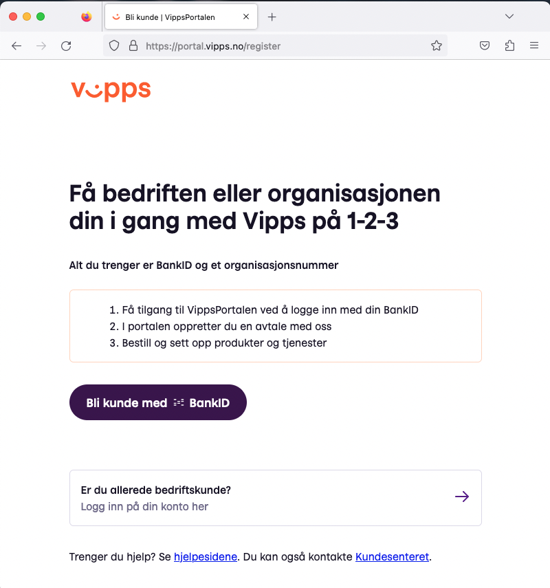
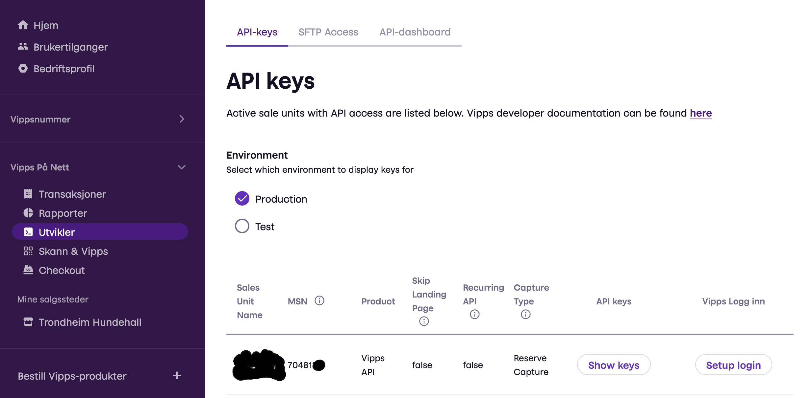
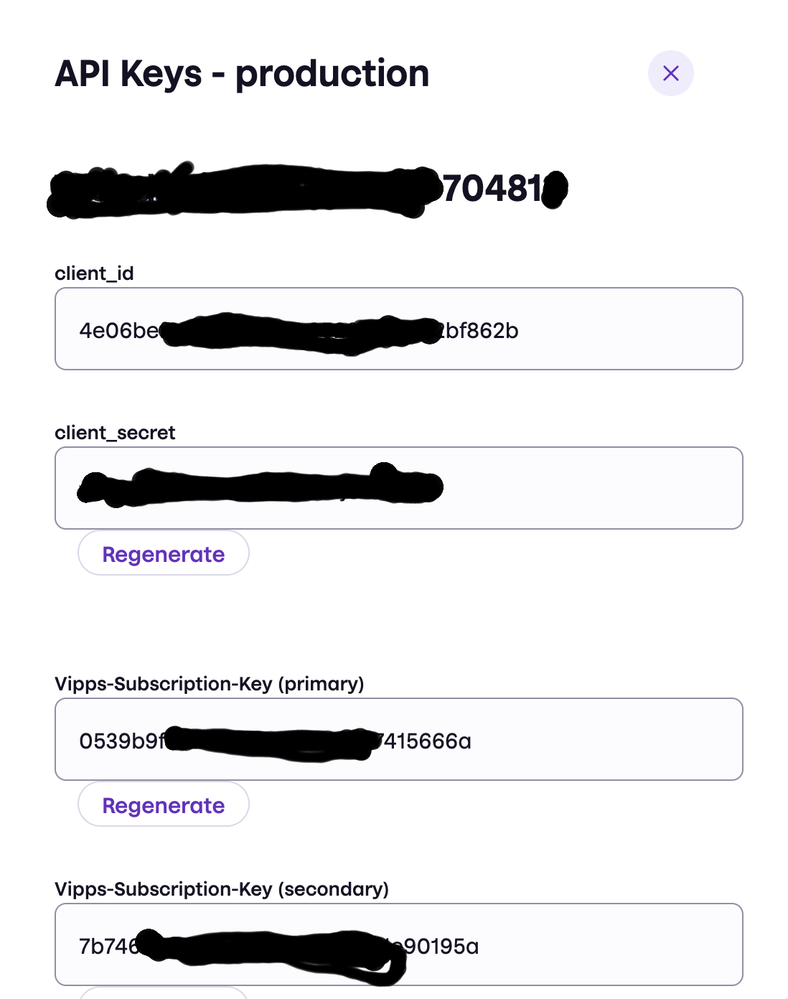

## Kom i gang med Vipps

Du trenger en bedriftsavtale med Vipps og produktet “**Vipps på nett**” for å kunne bruke Vipps sammen med Hunderhaller. Gå til [portal.vipps.no](http://portal.vipps.no) for å starte eller logge inn.

Du starter på [portal.vipps.no](http://portal.vipps.no) for å etablere vipps bedriftskonto som du kan bruke med Velpr.

Søknadsprosessen til Vipps for å få en bedriftskonto inneholder en sjekk på at utsalgsstedet ditt er i henhold til lover og regler. Du vil da kunne henvise til nettadressen til ditt velpr system og betingelsene og bookingsiden der. For at betingelsene skal være i henhold må du ha fylt ut informasjon om eier, adresse og org nummer i admin sidene på ditt velpr system. 

## Vipps integrasjon med Velpr

Når Vipps på nett er på plass i Vipps portalen kan man kopiere informasjon herfra til Hunderhaller.  

Informasjon fra API keys må kopieres inn i Velpr

Show API Keys dialogen. Det er client secret, client id og vipps subscription key primary som skal over til Velpr.
