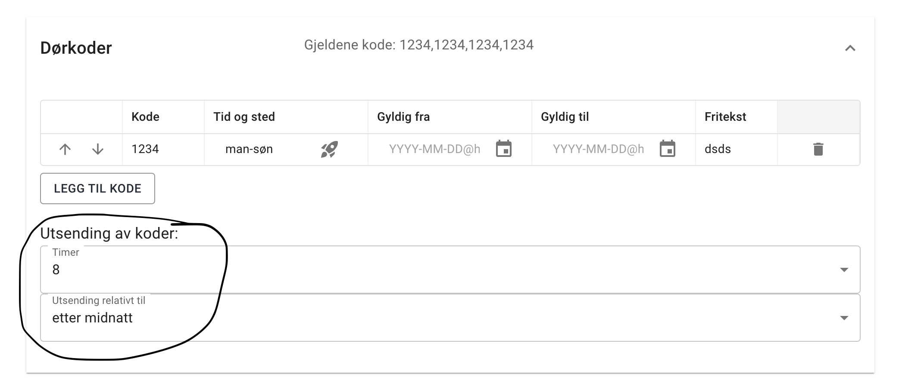

import { Aside } from '@astrojs/starlight/components';

<Aside type="tip" title="Høydepunkt">
Bekrefetelses dialog ved gjennomført booking - inkludert info om adgangskode
</Aside>

## Bekreftelses dialog ved gjennomført booking
Når kundene har betalt for en booking så vil de nå få en bekreftelses dialog med informasjon om adgangskode. Dette vil gi kunden en bedre opplevelse og gjøre det enklere for de å forstå hva som skjer 
etter at de har betalt. Hvis kunden har booket timer som har adgangskode så vil denne koden vises i bekreftelses dialogen - om koden er tilgjengelig.
Hvis adgangskoden ikke er tilgjengelig så vil kunden få informasjon om at de vil motta adgangskoden på epost.

## Mer fleksibel kodeutsending
Adgangskode modulen har nå en opsjon for å velge når koden skal bli tilgjengelig.
Du kan nå velge mellom å sende koden en gang etter midnatt på dagen for bookingen eller en gang etter midnatt på dagen før bookingen. 
Default er 2 timer før bookingen. 

## Minside utbedringer
Min side har nå fått oversikt over alle bookinger som er gjort. Dette vil gjøre det enklere for kundene å holde oversikt over sine bookinger. 
I tillegg er det nå muilg å endre navn, telefon og epost adresssen som kvitteringer og adgangskoder blir sendt til.

## Utleie-enheter
Utleie enhetene har nå fått et par nye instillinger som gjør det enklere å tilpasse hvordan disse blir vist i timevelgeren.
Man kan nå lage grupper av utleieenheter slik timevelgeren kan håndtere flere enn 3 utleieenheter. Bare en og en gruppe
vil da blie vist i timevelgeren. 

I tillegg kan man nå eksplisitt sette rekkefølgen på utleieenhetene i timevelgeren. Dette var før basert på alfabetisk rekkefølge. 
