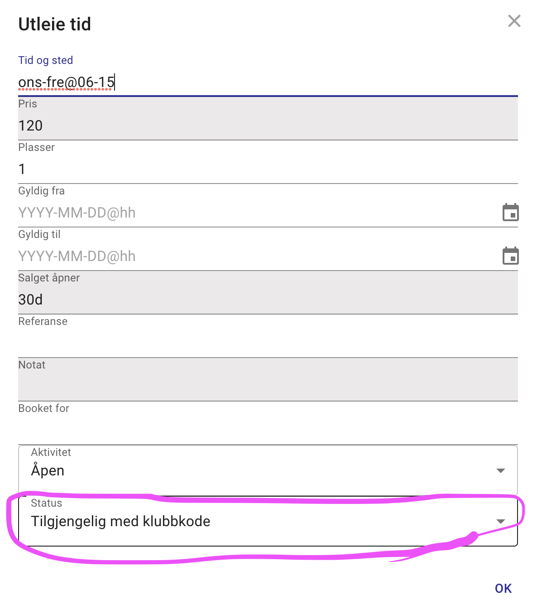
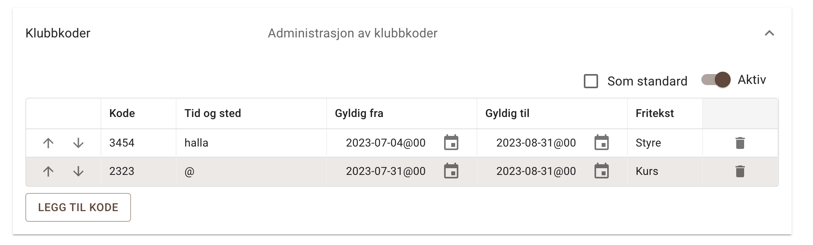
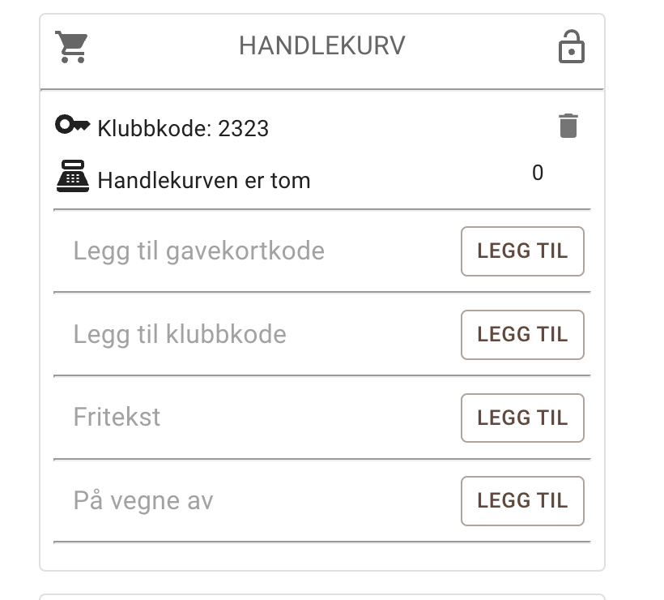
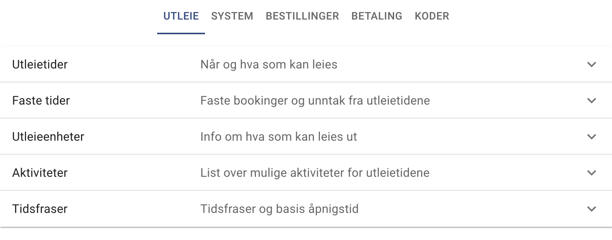
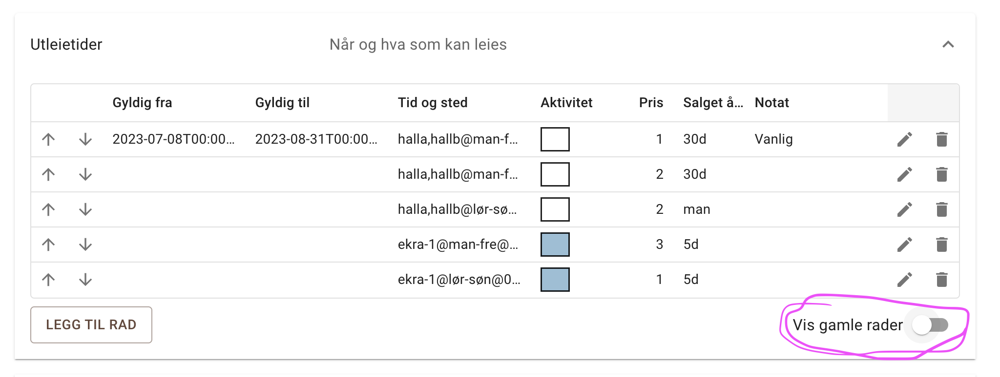
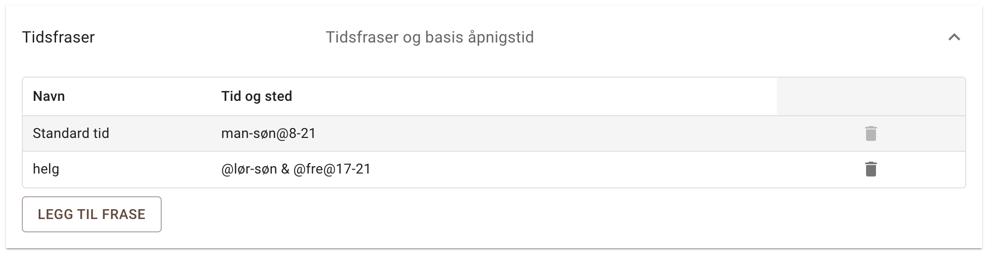
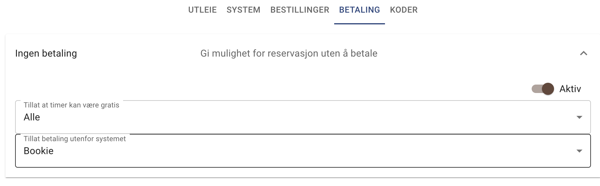
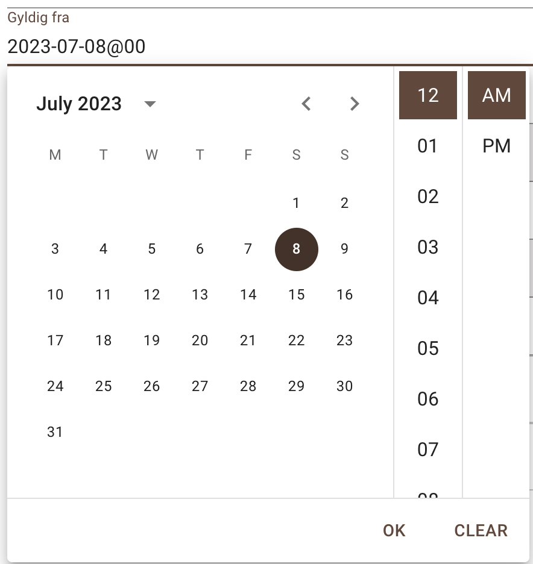

import { Image } from 'astro:assets';
import image1 from './2023-08/2023-08-1.png';
import { Aside } from '@astrojs/starlight/components';

<Aside type="tip" title="Høydepunkt">
Ny funksjon kalt “Klubbkoder” - der man kan avgrense hvem som kan booke utvalgte timer til en gruppe som har en klubbkode.
</Aside>
<Aside type="tip" title="Høydepunkt">
Ny administrasjons organisering
</Aside> 

## Klubbkode

Timevelgeren har har nå en henglås på de grønne feltene der timene er ledige men som er forbeholdt de med en klubbkode.

<Image src={image1} alt="Klubbkode" width="300px"/>

Hvilke timer som trenger en klubbkode defineres av utleie seksjonen - der man nå har et klubbkodevalg.

Klubbkodene administreres under Koder/Klubbkoder og distribueres av eier (altså ikke av systemet her)

Når man skal leie en klubbtime så må man først legge inn en klubbkode i handlekurven.

Hengelåse på timevelgeren vil forsvinne fra de timene som er tilkyttet den koden som man har lagt inn i handlekurven.

## Ny admin organisering

**Ny organisering** av adminsider og adminseksjoner. Hver seksjon kan kollapses og eksanpanderes slik at man ikke får altfor mye informasjon om gangen.

Menyen er den samme som før men har fått kortere og mer konsise navn.

## **Skjul utgåtte utleietider**

Har du angitt en gyldig til dato vil utleietider som er etter denne datoen ikke bli vist før man eksplisitt skrur på “Vis gamle rader” neder til høyre i bildet.

## Tidsfrase seksjon

**Tidsfraser** er en ny seksjon for å angi egne tidsfraser. F.eks “helg” - som man kan bruke for å definere utleietider, dørkoder eller klubbkoder. I tillegg er det her en standardtid som brukes til å fylle ut det som ikke spesifiseres i tid og sted feltene andre steder.

F.eks. Hvis man bare skriver “man” for mandag så vil det bety man@8-21 da den henter timene fra standardtiden i tilfellet under.

## Betalings seksjoner

Bedre administrasjon av **betalingsalternativer** inkludert om man kan ha gratis timer og evnt hvem som kan booke timer uten å betale (typisk eier). Det første valget gjør at om man definerer utleiepris til 0 så er det lov - man får da en knapp som sier at man kan fullføre bestillingen istedet for vipps eller paypal.

## Ny datovelger

Gyldig til og Gyldig fra felter har fått en bedre dato og time velger

