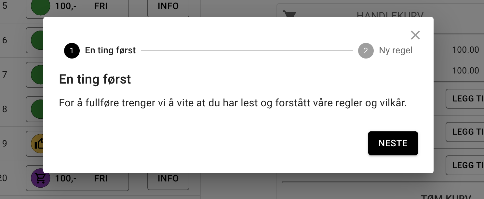

import { Aside } from '@astrojs/starlight/components';

<Aside type="tip" title="Høydepunkt">
Regler med bruker aksept
</Aside>

# Moduler

Man kan nå skru av og på funksjoner og egenskaper ved sitt system under admin → system → moduler.

> Arrangement støtte er ikke ferdig og kan ignoreres inntil videre.

# Regler og betingelser

Regler og betingelser kan nå settes opp til å kreve aksept fra brukere. Aksept kan kreves hver gang, en gang eller hver gang det er store endringer i dokumentet.

Betalingsbetingelser er påkrevet ved lov for alle tjenester som tar betalt. Dette er derfor et fast innslag i alle system. Regler og egenerklæringer er valgfritt og kan skrus på som en modul.

Man kan nå lage så mange betingelser og regler som man vil og tilknytte de til ulike tjenester. Feks kan regler for hall og regler for utebane nå separeres.

Får å endre eksisterende regel eller legge til ny regel må man først som admin av systemet gå til regelsiden og velge “ENDRE” nederst til venstre.

Om kan avkrever aksept av brukere vil brukerene få en dialog som viser regel dokumentene og en knapp for akseptering av reglene.

# Tidsfrase-velger

De stedene i systemet der man angir tid og sted har man nå fått en liten knapp med tegning av et romskip som tar deg til en dialog der dette kan gjøres grafisk.

“Vis faste” knappen ble ikke helt ferdig til denne versjonen og det finnes enkelte varianter av tidsfrasene som den ikke støtter. Man trenger da ikke bruke denne dialogen men skrive ut frasene som før.

# Roller

Denne versjonen er blitt bedre på å skille på forskjellige roller man har i systemet. Rollene som er definert listes opp under admin → system → roller

Rollene man kan ha er:

- **Eier**: Kan endre alt i systemet inkludert hvem som har hvilke roller
- **Administrator**: Kan endre alt unntatt hvem som har de ulike rollene
- **Supporter**: Kan booke på vegne av andre og potensielt ta betalt utenfor systemet (ikke betale) men ikke endre hva som leies ut og til hvilken pris eller lignende.
  - Tanken med denne er at man kan delegere påmeldingsansvar etc til noen uten at de har tilgang til hele systemet

# Standarisert endrings opplegg

Alle sider som tar endringer har nå en felles måte å gjøre dette på.

Nederst på sidene vil alle som har rollen Eier eller Administrator få opp et par knapper som viser hvilken modus man er i. Modusene er enten “Normal” da man ser siden slik alle andre brukerene ser siden, og “Endre” som da viser den samme siden med felter som kan endres på.

Dette gjelder da spesielt bookingsiden der dette før var lagt oppe til høyre.

# Annet

Det er masse andre mindre ting som er forbedret

- Standard salg åpner før under System → innstillinger respekteres nå
- Timene i kvitteringsepostene sorteres
- Knappen for å kjøpe gavekort har blitt grønn så den ble mer synlig
- Og helt sikker flere ting som jeg ikke husker.r

Take off
