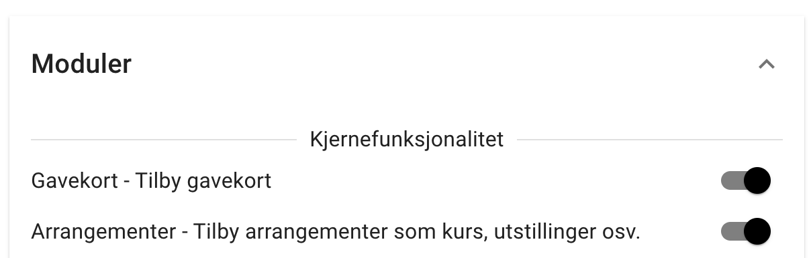
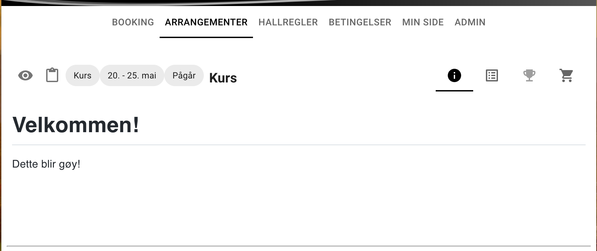
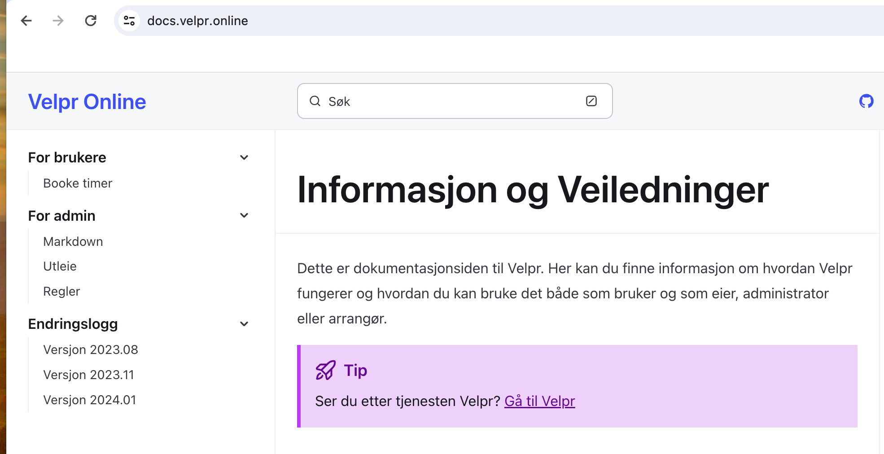

import { Aside } from '@astrojs/starlight/components';

<Aside type="tip" title="Høydepunkt">
Arrangementstøtte i beta
</Aside>

## Arrangement støtte - beta

Arrangement støtte er nå på plass i en beta versjon. Det betyr at de meste skal fungere men at jeg
regner med noen oppstartsproblemer. Rabatt funksjonaliteten trenger bl.a litt kjærlighet.

Men nå er det altså mulig å invitere til kurs, konkuranser, utstillinger, gruppetimer og egentlig alt man kan tenke seg.  

Dokumentasjon er på vei - men om man vil prøve seg frem så er det bare å skru må arrangement modulen i innstillinger: 

Vel inne på et arrangement kan de se slik ut:

## Ny dokumentasjons side
Systemet begynner å ha mange muligheter og mange knapper som man kan skru på. Bruksområdet til systemet har
også godt fra ren timeleie av hundehaller til å bli et generelt hundeaktivitets system. 

Jeg vil derfor fremover prøve å legge til dokumentasjon, veiledninger og guider under https://docs.velpr.online.

I løpet av året vil tjenesten også flyttes fra hundehaller.no til velpr.online. Dere skal ikke trenge å gjøre noe i den forbinnelse.

