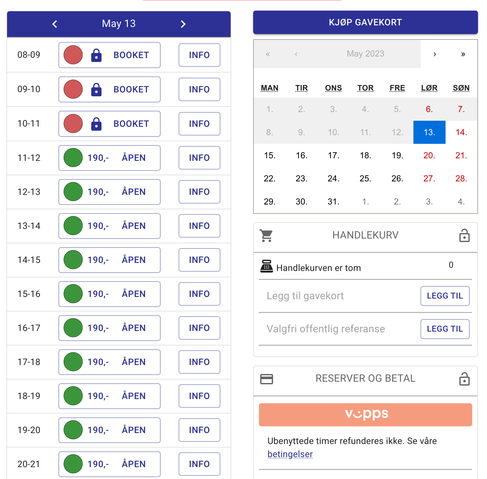
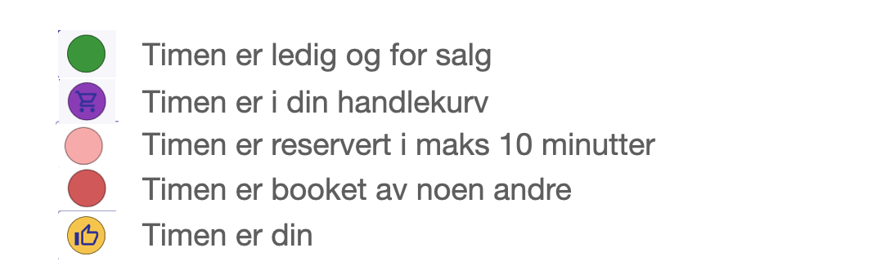

Bookingsiden kan se ut litt forskjellig fra hundehall til hundehall da de har forskjellige oppsett. Men ulikhetene er stort sett overfladiske.

De fargede sirklene representerer timen og status for timen. For å legge timer inn i handlekurven trykker man på denne sirkelen. I eksemplet under kan man trykke på hele knappen som har sirkelen i seg. Info knappen viser en boks nederst i vinduet med den informasjonen den sitter på for den timen. Det kan være seg fritekst fra utleier, referanse fra den som har leid timen, pin kode til inngangsdør hvis timen er din eller informasjon om når timen kommer for salg.

## Fargekoder

